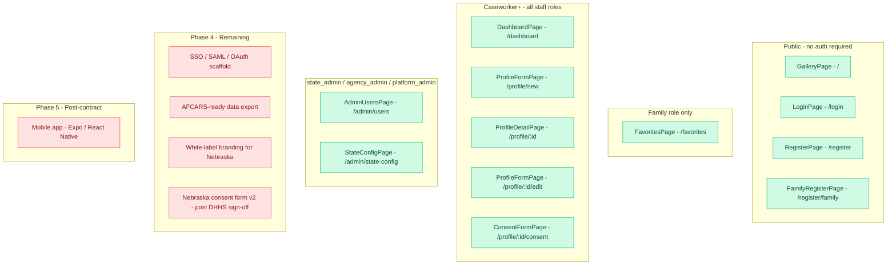
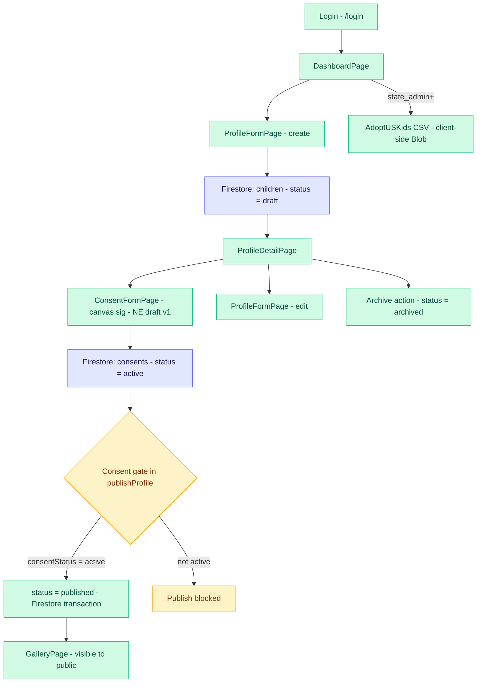
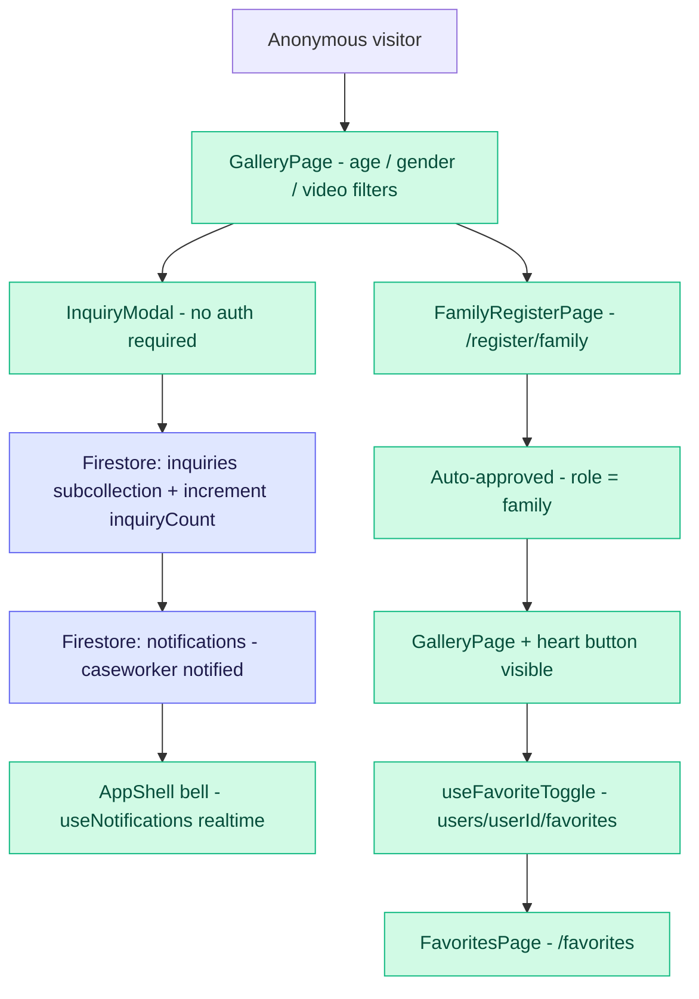
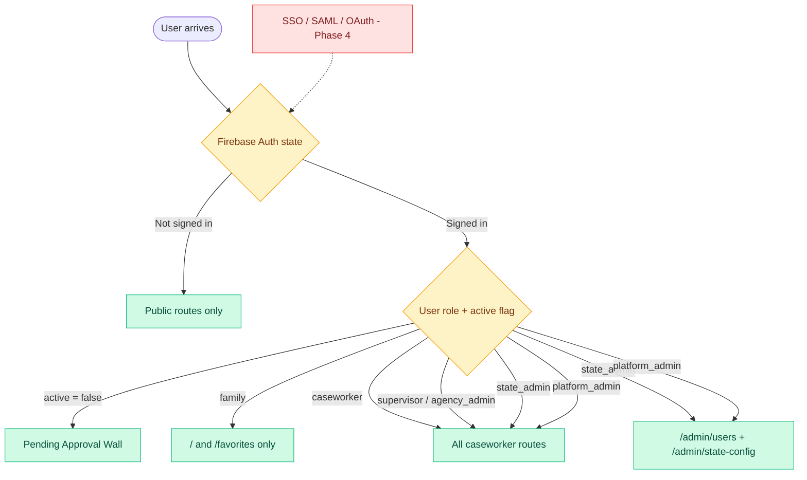
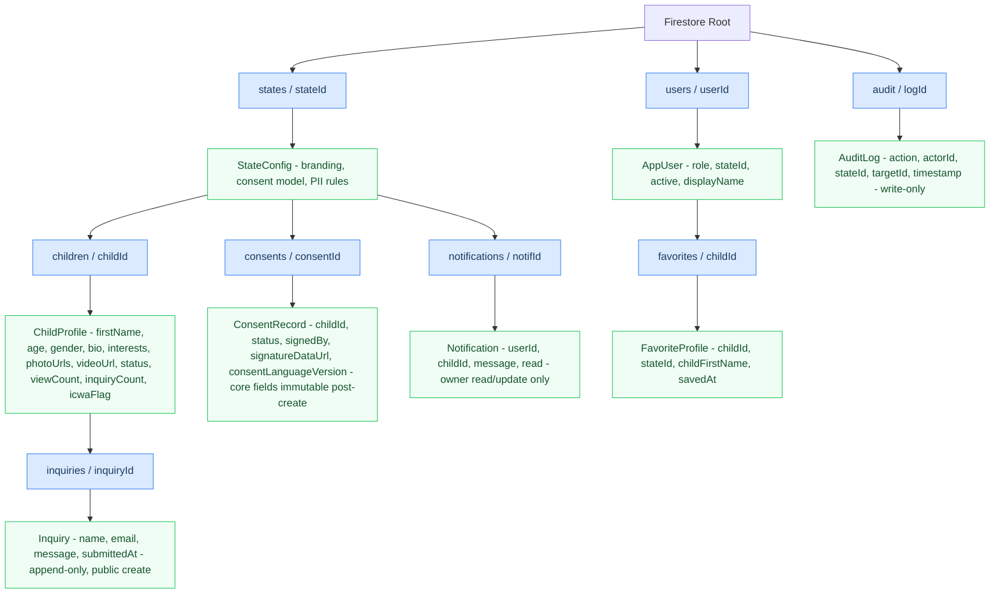
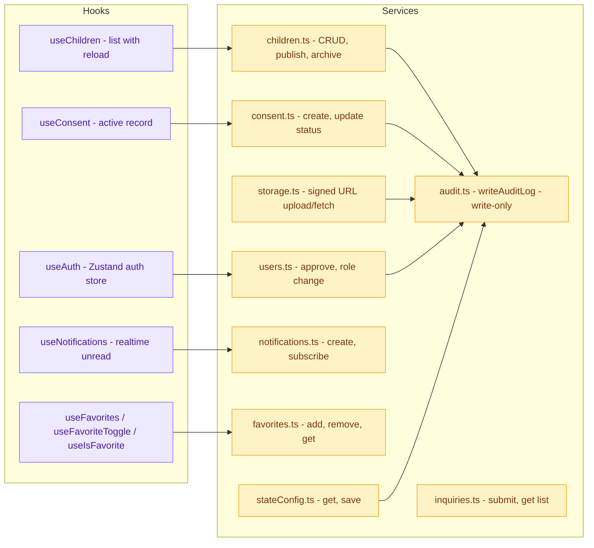

# Spencer's Home - Architecture & Flow

> Open preview: Cmd+Shift+V (requires Mermaid Preview extension).
> Green = Built | Red = Not yet built

---

## 1. Pages & Access Control

---

## 2. Caseworker Workflow - Profile to Publish

---

## 3. Family Workflow - Browse, Inquire, Save

---

## 4. Auth & Role Routing

---

## 5. Firestore Data Structure

---

## 6. Service & Hook Layer

---

## Build Status Summary

| Phase | Status | Notes |
|---|---|---|
| Phase 1 - Core Loop | Complete | Auth, profiles, consent, gallery, dashboard, media storage |
| Phase 2 - Compliance Layer | Complete | State config, Firestore RBAC rules, audit log, ICWA flag, PII warnings |
| Phase 3 - Engagement Layer | Complete | Family registration, favorites, inquiry notifications, AdoptUSKids CSV export |
| Phase 4 - Anchor State Hardening | In Progress | Security + Performance done. SSO, AFCARS, white-label, NE consent v2 remaining |
| Phase 5 - Mobile | Post-contract | Expo / React Native caseworker field capture app |
